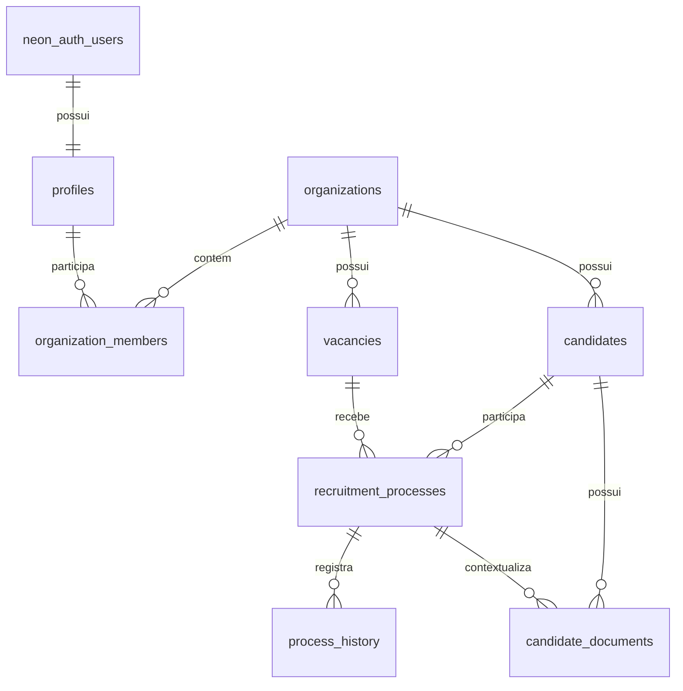

# Majurh — planejamento do produto e guia de implementação

> Documento de referência para construir o MVP no Codex.

## Status de implementação — 14/09/2026

O núcleo do MVP foi migrado para Neon: Neon Auth para identidade, Neon Postgres para dados relacionais e Vercel Blob privado para documentos. O acesso agora é fechado: a tela pública só permite entrar, administradores geram convites de uso único e novos membros concluem o cadastro no link recebido. A área de organização concentra o white-label, incluindo logo, cores, textos e banner da tela de login.

Validações executadas:

- `npm run typecheck`.
- `npm run build`.
- `npm run typecheck` — aprovado.
- `npm run build` — aprovado com variáveis de build temporárias.

Migração concluída: o schema e os dados de negócio do backup foram importados no Neon, o Blob privado foi criado em São Paulo e conectado ao `majurh` nos ambientes Development, Preview e Production. O PDF legado foi enviado para o Blob e o registro do documento foi atualizado. O domínio oficial `https://majurh.vercel.app` também foi cadastrado como origem confiável no Neon Auth. O passo a passo está em [docs/SETUP.md](./docs/SETUP.md).

As migrações `0002` a `0005` foram aplicadas no banco Neon e o fluxo de Administração voltou a carregar. A base de integrações está pronta; falta configurar `INTEGRATIONS_ENCRYPTION_KEY` antes de armazenar credenciais de provedores. A ponte `legacy_auth_users` preserva o vínculo dos e-mails migrados com a organização sem copiar hashes de senha do Supabase.

## 1. Visão do produto

O **Majurh** é uma plataforma B2B white-label para substituir controles dispersos em planilhas por um histórico confiável de candidatos e processos seletivos. Cada organização usa seu próprio espaço, identidade visual e equipe dentro da plataforma.

O sistema deve responder rapidamente a quatro perguntas:

1. Quem é este candidato e como posso contatá-lo?
2. Em qual etapa do processo ele está agora?
3. Quais documentos já foram enviados, aprovados ou estão pendentes?
4. Esta pessoa já participou de outro processo ou desistiu anteriormente?

### Frase do produto

> Controle de candidatos, documentos e histórico de processos seletivos em um só lugar.

### Público inicial

- **Recrutadora/RH:** cadastra candidatos, atualiza etapas, registra desistências e confere documentos.
- **Gestor do RH:** acompanha indicadores, processos parados e histórico de contratações.
- **Visualizador:** consulta dados sem alterar informações, quando essa permissão estiver habilitada.

O produto começa para uma empresa, mas o modelo de dados deve suportar mais de um usuário e uma organização desde o início.

## 2. Escopo do MVP

### Incluído

- Login por e-mail e senha.
- Dashboard operacional com indicadores e alertas simples.
- Cadastro e edição de candidatos.
- Busca por nome, CPF, RG, telefone e e-mail.
- Detecção de CPF já cadastrado antes de concluir um novo cadastro.
- Um candidato podendo participar de vários processos seletivos ao longo do tempo.
- Status atual do processo seletivo.
- Histórico automático de mudanças de status.
- Registro de desistência com motivo, observação e possibilidade de participar novamente.
- Upload, consulta e atualização de status de documentos.
- Perfil completo do candidato com abas de visão geral, documentos, processos e histórico.
- Filtros por status, vaga, período e responsável.
- Estados de carregamento, vazio, erro e sucesso em todas as telas principais.

### Fora do MVP

Não implementar agora: Kanban com arrastar e soltar, tarefas, calendário, notificações automáticas, WhatsApp, e-mail transacional, IA, folha de pagamento, colaboradores contratados e relatórios avançados. Esses itens ficam preparados no modelo de domínio, mas não devem aumentar o escopo da primeira entrega.

## 3. Princípios de produto

- **Histórico antes de duplicação:** o candidato é uma ficha permanente; cada vaga ou tentativa é um processo separado.
- **Operação rápida:** as ações mais frequentes devem caber em poucos cliques: buscar, abrir, atualizar status e anexar documento.
- **Dados sensíveis com contexto:** CPF, RG e documentos nunca aparecem em áreas públicas nem em URLs permanentes.
- **Estado sempre explícito:** status, pendência e erro devem ser comunicados com texto, cor e ícone.
- **MVP demonstrável:** a primeira versão precisa funcionar com dados reais de teste e contar uma história clara em uma apresentação.

## 4. Fluxos funcionais

### 4.1 Login e sessão

1. A pessoa acessa `/login`.
2. Informa e-mail e senha.
3. A aplicação valida a sessão no servidor e redireciona para `/dashboard`.
4. Novos usuários não encontram cadastro público: o administrador cria um convite em `/administracao`.
5. A pessoa convidada acessa `/convite/[token]`, cria a senha e é vinculada à organização.
6. Rotas internas sem sessão redirecionam para `/login`.
7. O menu do usuário permite sair.

Critérios de aceite:

- A senha nunca é armazenada na aplicação.
- O login público não oferece criação de conta.
- Um convite tem validade de sete dias, é armazenado apenas por hash e só pode ser aceito uma vez.
- Um usuário deslogado não consegue ler dados pelo navegador nem pela API.
- A sessão é renovada por cookies seguros no fluxo SSR.
- Mensagens de erro não revelam se um e-mail existe ou não.

### 4.2 Dashboard

Exibir, no mínimo:

- Candidatos em processos ativos.
- Processos em entrevista.
- Processos aguardando documentação.
- Contratações no mês.
- Desistências no período selecionado.
- Processos recentes.
- Documentos pendentes prioritários.
- Atividade recente do histórico.

Os números devem vir do banco, ter período explícito e permitir abrir a lista filtrada correspondente. Evitar indicadores decorativos sem ação associada.

### 4.3 Cadastro de candidato

Organizar o formulário em blocos curtos:

**Dados pessoais**

- Nome completo — obrigatório.
- CPF — obrigatório, normalizado e único dentro da organização.
- RG.
- Data de nascimento.
- Telefone.
- E-mail.

**Endereço**

- CEP, logradouro, número, complemento, bairro, cidade e estado.

**Habilitação e observações**

- Número da CNH, categoria e validade, quando aplicável.
- Observações gerais.

**Primeiro processo**

- Vaga.
- Unidade ou departamento.
- Responsável.
- Origem do candidato.
- Data de entrada no processo.

Ao digitar um CPF existente, mostrar uma advertência clara com o nome, quantidade de processos, último status e ação **Ver histórico**. Não bloquear automaticamente a consulta; bloquear apenas a criação duplicada do mesmo candidato.

### 4.4 Processo seletivo

O candidato pode ter muitos processos. O processo deve guardar seu próprio status, vaga, responsável, datas e resultado.

Status iniciais:

1. Novo candidato
2. Triagem
3. Entrevista
4. Avaliação
5. Aprovado
6. Documentação
7. Admissão
8. Contratado
9. Reprovado
10. Desistiu
11. Banco de talentos

As transições não precisam ser rigidamente lineares: o RH pode corrigir um status, desde que a ação seja registrada no histórico. Ao selecionar **Desistiu**, abrir o registro de motivo antes de salvar a mudança.

### 4.5 Desistência

Campos:

- Motivo: outra proposta, salário, horário, localização, benefícios, problemas pessoais, não respondeu, sem motivo informado ou outro.
- Observação livre.
- Pode participar novamente: sim, não ou avaliar antes.

O motivo deve ser vinculado ao processo, e não ao cadastro permanente do candidato. Assim, uma nova participação não herda uma desistência antiga de forma incorreta.

### 4.6 Documentos

Tipos iniciais:

- RG.
- CPF.
- CNH.
- Comprovante de residência.
- Carteira de trabalho.
- Currículo.
- Certificado.
- Outro.

Status do documento:

- Pendente.
- Enviado.
- Em análise.
- Aprovado.
- Reprovado.
- Solicitar novamente.

Para cada arquivo, mostrar nome, tipo, tamanho, data de envio, pessoa responsável e status. A ação de visualização deve gerar uma URL assinada com validade curta.

### 4.7 Perfil do candidato

Abas recomendadas:

- **Visão geral:** dados pessoais, contato e processo atual.
- **Documentos:** arquivos, pendências e revisão.
- **Processos:** linha do tempo de participações anteriores.
- **Histórico:** mudanças de status, observações e responsável.

No topo, exibir nome, CPF mascarado, status do processo atual e ações **Editar candidato**, **Novo processo** e **Adicionar documento**.

## 5. Rotas do Next.js

Usar App Router e separar o shell autenticado por grupo de rota:

```txt
app/
├── (auth)/login/page.tsx
├── (app)/layout.tsx
├── (app)/dashboard/page.tsx
├── (app)/candidatos/page.tsx
├── (app)/candidatos/novo/page.tsx
├── (app)/candidatos/[id]/page.tsx
├── (app)/processos/page.tsx
├── (app)/documentos/page.tsx
├── (app)/administracao/page.tsx
├── (app)/organizacao/page.tsx
├── (app)/configuracoes/page.tsx
├── convite/[token]/page.tsx
├── error.tsx
├── loading.tsx
└── not-found.tsx
```

Convenções:

- Server Components por padrão.
- Client Components somente para formulário, busca interativa, modal, tabs, upload e drag-and-drop futuro.
- Consultas de leitura podem ocorrer no Server Component com o cliente Neon server-side.
- Mutations devem usar Server Actions ou Route Handlers, validação compartilhada e retorno de erro tipado.
- Filtros e paginação devem ser refletidos nos parâmetros da URL.

## 6. Stack e arquitetura

### Front-end

- Next.js com App Router.
- TypeScript em modo estrito.
- Tailwind CSS.
- shadcn/ui como base dos componentes.
- Lucide React para ícones.
- React Hook Form + Zod para formulários e validação, se ainda não houver outra convenção no projeto.
- `next/font` para carregar as fontes definidas em [DESIGN.md](./DESIGN.md).

### Neon e Vercel

- Neon Auth, baseado em Better Auth, para e-mail/senha e sessão.
- Neon Postgres para dados relacionais.
- Vercel Blob privado para documentos sensíveis.
- `@neondatabase/auth` para cliente, handler e middleware de autenticação.
- `@neondatabase/serverless` para consultas server-side com parâmetros.
- `@vercel/blob` para upload, leitura autenticada e exclusão de arquivos.
- Migração versionada em `neon/migrations/`.
- Autorização por organização e papel aplicada nas Route Handlers.

Variáveis esperadas em `.env.local`:

```env
DATABASE_URL=
NEON_AUTH_BASE_URL=
NEON_AUTH_COOKIE_SECRET=
BLOB_READ_WRITE_TOKEN=
```

Não colocar `service_role` ou secret key em variável `NEXT_PUBLIC_` nem em código executado no navegador. Se uma operação realmente privilegiada surgir no futuro, ela deve ficar em servidor confiável e ser revisada separadamente.

No SSR, usar o cliente Neon Auth para Client Components e `auth.getSession()` em Server Components, Server Actions e Route Handlers. O `proxy.ts` usa o middleware oficial do Neon Auth. Toda autorização de dados é feita no servidor, consultando `organization_members` antes da operação.

## 7. Modelo de dados proposto

Não usar uma tabela genérica `users` para usuários da aplicação: a identidade vive no schema gerenciado `neon_auth`; o perfil e a associação à organização ficam nas tabelas abaixo.



### Tabelas

#### `profiles`

`id text primary key`, `full_name`, `avatar_url`, `created_at`, `updated_at`.

#### `legacy_auth_users`

Catálogo temporário de migração com `id`, `email`, `full_name` e `created_at`. Permite resolver o ID antigo do Supabase quando a pessoa entra no Neon Auth com o mesmo e-mail. Não armazena senha nem token.

#### `organizations`

`id`, `name`, `slug`, identidade visual opcional, identidade da tela de login, `created_at`, `updated_at`.

#### `organization_members`

`id`, `organization_id`, `user_id`, `email`, `role`, `created_at`.

Roles iniciais: `admin`, `recruiter`, `viewer`. Criar índice composto e restrição única para `(organization_id, user_id)`.

#### `organization_invitations`

`id`, `organization_id`, `email`, `role`, `token_hash`, `invited_by`, `expires_at`, `accepted_at`, `created_at`.

O token bruto só aparece uma vez para o administrador copiar o link. A aceitação cria ou atualiza o perfil e a associação do usuário na organização.

#### `vacancies`

`id`, `organization_id`, `title`, `department`, `unit`, `is_active`, `created_at`, `updated_at`.

#### `candidates`

`id`, `organization_id`, `full_name`, `cpf`, `cpf_normalized`, `rg`, `birth_date`, `phone`, `email`, campos de endereço, `cnh_number`, `cnh_category`, `cnh_expires_at`, `notes`, `created_by`, `created_at`, `updated_at`.

Adicionar `unique (organization_id, cpf_normalized)`. Não usar CPF como chave primária nem como identificador em URLs.

#### `recruitment_processes`

`id`, `organization_id`, `candidate_id`, `vacancy_id`, `responsible_user_id`, `source`, `status`, `started_at`, `finished_at`, `withdrawal_reason_code`, `withdrawal_notes`, `can_apply_again`, `created_at`, `updated_at`.

O status atual fica nesta tabela; o histórico é append-only.

#### `candidate_documents`

`id`, `organization_id`, `candidate_id`, `process_id`, `document_type`, `status`, `storage_path`, `original_name`, `mime_type`, `size_bytes`, `uploaded_by`, `reviewed_by`, `reviewed_at`, `notes`, `created_at`, `updated_at`.

`storage_path` é o caminho interno do Storage, não uma URL pública.

#### `process_history`

`id`, `organization_id`, `process_id`, `actor_user_id`, `action`, `old_status`, `new_status`, `notes`, `created_at`.

O histórico não deve ser editável pela interface. Mudanças de status devem atualizar o processo e inserir o histórico na mesma transação, preferencialmente por uma função/RPC invocável pelo usuário autenticado ou por trigger revisada.

#### `withdrawal_reasons`

Pode começar como enum ou tabela seed. Usar tabela se a empresa precisar editar os motivos sem nova migração.

## 8. Segurança, autorização e LGPD

### Autorização por organização

- Toda linha de domínio tem `organization_id`.
- Toda Route Handler autentica com Neon Auth e consulta `organization_members` antes de ler ou alterar dados.
- Papéis da aplicação: `admin`, `recruiter` e `viewer`, com verificação de nível para cada mutação.
- Nunca usar `user_metadata` para decidir permissões; o papel fica em `organization_members`.
- Consultas usam parâmetros; nomes de colunas dinâmicos só entram depois de passar por listas fechadas de validação.
- Criar teste de permissão para cada tabela e operação antes de considerar a migração pronta.

### Vercel Blob privado

- Criar Blob Store privado `candidate-documents`.
- Estruturar caminhos como `{organization_id}/{candidate_id}/{uuid}-{nome-seguro}`.
- Usar upload server-side para arquivos de até 6 MB no MVP; se o limite precisar aumentar, avaliar upload multipart.
- Não usar `upsert` como padrão: gerar caminho único para evitar sobrescrita e problemas de cache.
- Validar extensão, MIME type e tamanho antes do upload.
- Entregar arquivos por rota autenticada com `get()` do Blob privado e cache `no-store`.
- Nunca usar Blob público para documentos pessoais.

### Dados pessoais

- Mascarar CPF e documentos na listagem e no cabeçalho do perfil.
- Não registrar CPF, RG, e-mail ou conteúdo de arquivo em logs.
- Definir com a empresa prazo de retenção, rotina de exclusão/anonimização e quem pode baixar documentos.
- Mostrar somente os campos necessários para cada tarefa.
- Tratar este documento como orientação técnica, não como parecer jurídico sobre LGPD.

## 9. Componentes e organização sugerida

```txt
src/
├── app/
├── components/
│   ├── ui/                 # shadcn/ui
│   ├── layout/             # sidebar, header, shell
│   ├── dashboard/
│   ├── candidates/
│   ├── processes/
│   └── documents/
├── lib/
│   ├── auth/
│   │   ├── client.ts
│   │   └── server.ts
│   ├── neon/
│   │   └── db.ts
│   ├── validations/
│   ├── formatters/
│   └── permissions/
├── types/
│   └── (tipos de domínio próximos às features)
└── styles/
```

Componentes prioritários:

- `AppShell`, `Sidebar`, `Topbar`.
- `PageHeader`, `StatCard`, `StatusBadge`.
- `CandidateSearch`, `CandidateTable`, `CandidateForm`.
- `DuplicateCandidateAlert`.
- `ProcessStatusSelect`, `ProcessTimeline`.
- `WithdrawalDialog`.
- `DocumentList`, `DocumentUpload`, `DocumentStatusBadge`.
- `EmptyState`, `ErrorState`, `ConfirmDialog`, `Toast`.

## 10. Ordem de desenvolvimento

### Fase 0 — Fundação

- Criar projeto Next.js, TypeScript estrito e Tailwind.
- Instalar e configurar shadcn/ui, Lucide e fontes.
- Criar `AppShell`, tokens e estados de loading/erro.
- Configurar `.env.example`, lint, formatador e lockfile.

### Fase 1 — Acesso e banco

- Criar recurso Neon conectado ao Vercel `majurh`.
- Criar migração para organizações, perfis, membros, vagas, candidatos, processos e histórico.
- Configurar Neon Auth, handler, cliente e `proxy.ts`.
- Aplicar autorização server-side por organização e papel.
- Conectar Blob Store privado para documentos.

### Fase 2 — Núcleo do fluxo

- Lista, busca e filtros de candidatos.
- Cadastro com normalização e alerta de CPF repetido.
- Perfil do candidato.
- Criação de múltiplos processos.
- Alteração de status com histórico transacional.
- Registro de desistência.

### Fase 3 — Documentos e dashboard

- Bucket privado e políticas de Storage.
- Upload e revisão de documentos.
- Dashboard com consultas reais e links para listas filtradas.
- Dados de demonstração não sensíveis.

### Fase 4 — Preparação da apresentação

- Revisar responsividade e acessibilidade.
- Validar fluxos com uma pessoa do RH.
- Testar permissões com admin, recruiter e viewer.
- Conferir mensagens, estados vazios e tratamento de falhas.
- Preparar roteiro de apresentação com o caso “candidato já desistiu antes”.

## 11. Critérios de pronto do MVP

- [ ] Login, logout e proteção de rotas funcionando.
- [ ] Admin consegue configurar a organização, criar/revogar convites, cadastrar vaga e candidato.
- [ ] Login público não oferece cadastro e pessoa sem vínculo fica bloqueada até receber um convite.
- [ ] Convite de uso único cria o perfil e a associação à organização.
- [ ] CPF duplicado gera alerta e não cria ficha repetida.
- [ ] Um candidato pode ter dois ou mais processos.
- [ ] Troca de status salva o histórico com ator e horário.
- [ ] Status `Desistiu` exige motivo e permite registrar observação.
- [ ] Documento é enviado para Blob privado e abre via rota autenticada.
- [ ] Dashboard usa dados reais do banco.
- [ ] Viewer não consegue alterar dados.
- [ ] Autorização por organização e Blob privado foram testados para permitir e negar acesso.
- [ ] Configurar credenciais de Catho, Sólides, LinkedIn e Indeed pela área de integrações.
- [ ] Publicar vagas e importar candidaturas por adaptadores oficiais, com logs e retentativas.
- [ ] Nenhuma chave privilegiada chega ao navegador.
- [ ] Interface funciona em desktop e mobile.
- [ ] Fluxos principais têm feedback de carregamento, erro e sucesso.

## 12. Referências técnicas atuais

- [Neon Auth para Next.js](https://github.com/neondatabase/neon-js/blob/main/packages/auth/NEXT-JS.md)
- [Neon Serverless Driver](https://neon.tech/docs/serverless/serverless-driver)
- [Integração Neon na Vercel](https://vercel.com/integrations/neon)
- [Vercel Blob privado](https://vercel.com/docs/vercel-blob/private-storage)

## 13. Módulo de produtividade

A rota `/produtividade` concentra as ferramentas de trabalho diário do time de RH:

- **Kanban:** cards em `A fazer`, `Em andamento` e `Concluído`, com criação rápida e arrastar-e-soltar.
- **TO-DO:** lista de ações com conclusão, prioridade e filtros por hoje ou prioridade alta.
- **Time tracker:** sessão de foco vinculada a uma tarefa, com iniciar, pausar e zerar.
- **Calendário:** grade mensal, seleção de dia, criação de compromissos e indicação de origem local.
- **Brainstorm:** canvas livre no estilo Miro, com notas posicionáveis em duas dimensões e sem colunas de fluxo. No canvas, o botão direito abre ações rápidas para criar nota, inserir imagem local de até 1,5 MB, adicionar moldura ou excluir o item selecionado.

Nesta primeira camada, os dados dessas ferramentas são persistidos no `localStorage` do navegador para permitir validação rápida do fluxo sem colocar dados de produtividade em tabelas antes de fechar o modelo de colaboração. A próxima etapa deve migrar os itens para o Neon por organização e usuário, registrar histórico de movimentações e substituir o armazenamento local por APIs autenticadas.

O calendário já tem uma interface própria alinhada aos tokens do produto. A integração com Google Calendar e Outlook deve ser implementada por OAuth no servidor, com tokens criptografados e escopo mínimo. Os botões atuais deixam explícita essa preparação e não tentam autenticar sem as credenciais da organização. O [CalendarJS](https://calendarjs.com/) pode ser avaliado como camada de agenda/timeline na etapa de sincronização, mantendo o tema visual do tenant.

### Integrações de recrutamento

O backend possui a base multi-tenant em `organization_integrations`, com status por provedor e credenciais criptografadas com `INTEGRATIONS_ENCRYPTION_KEY`. A API não retorna o segredo armazenado. Os próximos adaptadores devem normalizar vagas, candidatos e candidaturas para as tabelas internas, preservar o provedor em `recruitment_processes.source` e registrar o identificador externo para evitar duplicidade.

Os conectores devem usar as APIs oficiais. A API da Sólides usa token emitido pela própria plataforma; Catho disponibiliza API de vagas para empresas; LinkedIn Talent Solutions e Indeed condicionam os fluxos de ATS a aprovação/parceria. Até que as credenciais e aprovações estejam disponíveis, a integração permanece em estado `pending` e não tenta fazer chamadas externas.

### Diretriz white-label B2B

Majurh é a marca da plataforma e o fallback visual. A organização é o tenant que aparece no espaço autenticado e pode configurar nome exibido, logo, cor principal, cor de destaque, banner, texto de apoio, título e descrição da tela de login em `/organizacao`; o nome e a logo também atualizam o título da aba e o favicon. O link `/login?org={slug}` apresenta a identidade pública do tenant. O vínculo de cada usuário continua isolado por `organization_members`; nenhuma identidade, configuração ou dado operacional deve atravessar organizações.

A tela padrão de `/login` segue o mockup Majurh em composição dividida: formulário claro à esquerda e arte `public/brand/majurh-login-art.png` à direita. A identidade base usa vinho, vermelho queimado, coral, creme e dourado derivados da arte local. A marca utiliza `public/brand/majurh-dog-mark.svg`, o wordmark editável (`Maju RH` no fallback) e quatro métodos visuais com logos locais de Google, Microsoft, Sólides e LinkedIn; os métodos permanecem desativados até os fluxos de autenticação serem implementados. As imagens customizadas do white-label continuam sendo arquivos enviados ao armazenamento privado.

As logos dos métodos alternativos de login usam Three.js em canvases transparentes isolados: ao passar o mouse, cada marca faz uma volta 3D no eixo Y e retorna centralizada. A logo principal continua como imagem SVG normal. O componente mantém um fallback de imagem local enquanto a textura carrega e respeita `prefers-reduced-motion`.

O formulário também oferece sugestões locais de domínio enquanto o e-mail é digitado, confirma visualmente um formato reconhecido e apresenta a força progressiva da senha com pontos orbitais e barras sem expor o valor. Ao enviar, a tela entra em um loading minimalista que mantém apenas o cachorro da marca com uma animação suave de piscar; o texto de status continua disponível para tecnologias assistivas.

O gerenciamento de pessoas fica separado em `/administracao`. Somente administradores podem criar ou revogar convites, e os papéis de novos membros começam limitados a `recruiter` ou `viewer`. O envio de e-mail transacional ainda não está conectado: o link é gerado para cópia manual, evitando colocar credenciais de provedor no navegador.

### Referência de design

O sistema visual adota o [Material Design 3](https://m3.material.io/) como referência de fundação: papéis semânticos de cor, tokens compartilhados, estados de interação, foco visível e layouts adaptativos. O produto não replica a paleta nem os componentes do Material; os papéis `primary`, `surface`, `on-surface` e `outline` são mapeados para a identidade configurada do tenant, com Majurh como fallback. A sidebar permanece como trilho de navegação e as páginas usam composição de área principal com painel de apoio quando o conteúdo pedir contexto lateral.

### Critérios de aceite da camada visual

- [ ] A navegação lateral abre `/produtividade` e mantém o estado ativo.
- [ ] Cards do Kanban podem ser movidos entre colunas com mouse.
- [ ] Tarefas, eventos e notas do canvas podem ser criados e persistem após recarregar a página no mesmo navegador.
- [ ] Brainstorm permite posicionar notas livremente no canvas, sem transformar ideias em etapas.
- [ ] Timer inicia, pausa e atualiza o tempo em tempo real.
- [ ] Calendário permite navegar entre meses e criar evento no dia escolhido.
- [ ] A tela funciona em desktop e mobile, com foco visível e redução de movimento respeitada.
- [ ] Administrador consegue configurar nome, logo, cores e a composição da tela de login sem afetar outra organização.
- [ ] A tela de login aceita a identidade do tenant por slug e mantém o fallback do Majurh.
- [ ] Majurh aparece como fallback quando a organização não possui personalização.
- [ ] Google e Outlook só são considerados concluídos após OAuth, sincronização incremental, revogação e tratamento de conflitos testados.
