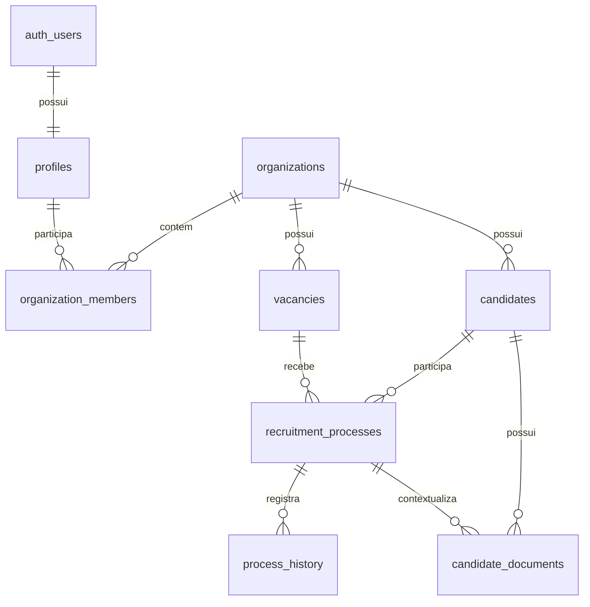

# Vieira Couto RH — planejamento do produto e guia de implementação

> Documento de referência para construir o MVP no Codex.

## Status de implementação — 27/08/2026

O MVP já possui a fundação SSR do Supabase, autenticação por e-mail e senha, AppShell responsivo, dashboard operacional, CRUD de candidatos, processos com histórico automático, upload privado e revisão de documentos. O front também administra vagas em Configurações, alerta CPF duplicado durante o cadastro e registra desistências em um diálogo próprio com motivo, observação e decisão de reentrada. As páginas principais têm estados de carregamento, vazio e erro.

Validações executadas:

- `npm run typecheck`.
- `npm run build`.
- `supabase db lint --local --fail-on error` — nenhum erro nos schemas.
- `supabase test db` — 24/24 testes, incluindo isolamento por organização e papéis admin/viewer.

Pendência de ambiente: configurar um projeto Supabase real, ou manter Auth/REST/Storage locais ativos, para executar o fluxo de navegador ponta a ponta. O passo a passo está em [docs/SETUP.md](./docs/SETUP.md).

## 1. Visão do produto

O **Vieira Couto RH** é uma aplicação interna para substituir controles dispersos em planilhas por um histórico confiável de candidatos e processos seletivos.

O sistema deve responder rapidamente a quatro perguntas:

1. Quem é este candidato e como posso contatá-lo?
2. Em qual etapa do processo ele está agora?
3. Quais documentos já foram enviados, aprovados ou estão pendentes?
4. Esta pessoa já participou de outro processo ou desistiu anteriormente?

### Frase do produto

> Controle de candidatos, documentos e histórico de processos seletivos em um só lugar.

### Público inicial

- **Recrutadora/RH:** cadastra candidatos, atualiza etapas, registra desistências e confere documentos.
- **Gestor do RH:** acompanha indicadores, processos parados e histórico de contratações.
- **Visualizador:** consulta dados sem alterar informações, quando essa permissão estiver habilitada.

O produto começa para uma empresa, mas o modelo de dados deve suportar mais de um usuário e uma organização desde o início.

## 2. Escopo do MVP

### Incluído

- Login por e-mail e senha.
- Dashboard operacional com indicadores e alertas simples.
- Cadastro e edição de candidatos.
- Busca por nome, CPF, RG, telefone e e-mail.
- Detecção de CPF já cadastrado antes de concluir um novo cadastro.
- Um candidato podendo participar de vários processos seletivos ao longo do tempo.
- Status atual do processo seletivo.
- Histórico automático de mudanças de status.
- Registro de desistência com motivo, observação e possibilidade de participar novamente.
- Upload, consulta e atualização de status de documentos.
- Perfil completo do candidato com abas de visão geral, documentos, processos e histórico.
- Filtros por status, vaga, período e responsável.
- Estados de carregamento, vazio, erro e sucesso em todas as telas principais.

### Fora do MVP

Não implementar agora: Kanban com arrastar e soltar, tarefas, calendário, notificações automáticas, WhatsApp, e-mail transacional, IA, folha de pagamento, colaboradores contratados e relatórios avançados. Esses itens ficam preparados no modelo de domínio, mas não devem aumentar o escopo da primeira entrega.

## 3. Princípios de produto

- **Histórico antes de duplicação:** o candidato é uma ficha permanente; cada vaga ou tentativa é um processo separado.
- **Operação rápida:** as ações mais frequentes devem caber em poucos cliques: buscar, abrir, atualizar status e anexar documento.
- **Dados sensíveis com contexto:** CPF, RG e documentos nunca aparecem em áreas públicas nem em URLs permanentes.
- **Estado sempre explícito:** status, pendência e erro devem ser comunicados com texto, cor e ícone.
- **MVP demonstrável:** a primeira versão precisa funcionar com dados reais de teste e contar uma história clara em uma apresentação.

## 4. Fluxos funcionais

### 4.1 Login e sessão

1. A pessoa acessa `/login`.
2. Informa e-mail e senha.
3. A aplicação valida a sessão no servidor e redireciona para `/dashboard`.
4. Rotas internas sem sessão redirecionam para `/login`.
5. O menu do usuário permite sair.

Critérios de aceite:

- A senha nunca é armazenada na aplicação.
- Um usuário deslogado não consegue ler dados pelo navegador nem pela API.
- A sessão é renovada por cookies seguros no fluxo SSR.
- Mensagens de erro não revelam se um e-mail existe ou não.

### 4.2 Dashboard

Exibir, no mínimo:

- Candidatos em processos ativos.
- Processos em entrevista.
- Processos aguardando documentação.
- Contratações no mês.
- Desistências no período selecionado.
- Processos recentes.
- Documentos pendentes prioritários.
- Atividade recente do histórico.

Os números devem vir do banco, ter período explícito e permitir abrir a lista filtrada correspondente. Evitar indicadores decorativos sem ação associada.

### 4.3 Cadastro de candidato

Organizar o formulário em blocos curtos:

**Dados pessoais**

- Nome completo — obrigatório.
- CPF — obrigatório, normalizado e único dentro da organização.
- RG.
- Data de nascimento.
- Telefone.
- E-mail.

**Endereço**

- CEP, logradouro, número, complemento, bairro, cidade e estado.

**Habilitação e observações**

- Número da CNH, categoria e validade, quando aplicável.
- Observações gerais.

**Primeiro processo**

- Vaga.
- Unidade ou departamento.
- Responsável.
- Origem do candidato.
- Data de entrada no processo.

Ao digitar um CPF existente, mostrar uma advertência clara com o nome, quantidade de processos, último status e ação **Ver histórico**. Não bloquear automaticamente a consulta; bloquear apenas a criação duplicada do mesmo candidato.

### 4.4 Processo seletivo

O candidato pode ter muitos processos. O processo deve guardar seu próprio status, vaga, responsável, datas e resultado.

Status iniciais:

1. Novo candidato
2. Triagem
3. Entrevista
4. Avaliação
5. Aprovado
6. Documentação
7. Admissão
8. Contratado
9. Reprovado
10. Desistiu
11. Banco de talentos

As transições não precisam ser rigidamente lineares: o RH pode corrigir um status, desde que a ação seja registrada no histórico. Ao selecionar **Desistiu**, abrir o registro de motivo antes de salvar a mudança.

### 4.5 Desistência

Campos:

- Motivo: outra proposta, salário, horário, localização, benefícios, problemas pessoais, não respondeu, sem motivo informado ou outro.
- Observação livre.
- Pode participar novamente: sim, não ou avaliar antes.

O motivo deve ser vinculado ao processo, e não ao cadastro permanente do candidato. Assim, uma nova participação não herda uma desistência antiga de forma incorreta.

### 4.6 Documentos

Tipos iniciais:

- RG.
- CPF.
- CNH.
- Comprovante de residência.
- Carteira de trabalho.
- Currículo.
- Certificado.
- Outro.

Status do documento:

- Pendente.
- Enviado.
- Em análise.
- Aprovado.
- Reprovado.
- Solicitar novamente.

Para cada arquivo, mostrar nome, tipo, tamanho, data de envio, pessoa responsável e status. A ação de visualização deve gerar uma URL assinada com validade curta.

### 4.7 Perfil do candidato

Abas recomendadas:

- **Visão geral:** dados pessoais, contato e processo atual.
- **Documentos:** arquivos, pendências e revisão.
- **Processos:** linha do tempo de participações anteriores.
- **Histórico:** mudanças de status, observações e responsável.

No topo, exibir nome, CPF mascarado, status do processo atual e ações **Editar candidato**, **Novo processo** e **Adicionar documento**.

## 5. Rotas do Next.js

Usar App Router e separar o shell autenticado por grupo de rota:

```txt
app/
├── (auth)/login/page.tsx
├── (app)/layout.tsx
├── (app)/dashboard/page.tsx
├── (app)/candidatos/page.tsx
├── (app)/candidatos/novo/page.tsx
├── (app)/candidatos/[id]/page.tsx
├── (app)/processos/page.tsx
├── (app)/documentos/page.tsx
├── (app)/configuracoes/page.tsx
├── error.tsx
├── loading.tsx
└── not-found.tsx
```

Convenções:

- Server Components por padrão.
- Client Components somente para formulário, busca interativa, modal, tabs, upload e drag-and-drop futuro.
- Consultas de leitura podem ocorrer no Server Component com o cliente Supabase de servidor.
- Mutations devem usar Server Actions ou Route Handlers, validação compartilhada e retorno de erro tipado.
- Filtros e paginação devem ser refletidos nos parâmetros da URL.

## 6. Stack e arquitetura

### Front-end

- Next.js com App Router.
- TypeScript em modo estrito.
- Tailwind CSS.
- shadcn/ui como base dos componentes.
- Lucide React para ícones.
- React Hook Form + Zod para formulários e validação, se ainda não houver outra convenção no projeto.
- `next/font` para carregar as fontes definidas em [DESIGN.md](./DESIGN.md).

### Supabase

- Supabase Auth para e-mail e senha.
- Supabase PostgreSQL para dados relacionais.
- Supabase Storage para documentos.
- `@supabase/ssr` para clientes de navegador/servidor e cookies.
- `@supabase/supabase-js` para acesso ao SDK.
- Migrações versionadas em `supabase/migrations/`.
- Testes de RLS em `supabase/tests/`.

Variáveis esperadas em `.env.local`:

```env
NEXT_PUBLIC_SUPABASE_URL=
NEXT_PUBLIC_SUPABASE_PUBLISHABLE_KEY=
```

Não colocar `service_role` ou secret key em variável `NEXT_PUBLIC_` nem em código executado no navegador. Se uma operação realmente privilegiada surgir no futuro, ela deve ficar em servidor confiável e ser revisada separadamente.

No SSR, usar cliente de navegador para Client Components e cliente de servidor para Server Components, Server Actions e Route Handlers. O `proxy.ts` deve renovar a sessão, e a proteção de identidade deve usar `supabase.auth.getClaims()` ou `getUser()` quando for necessária uma leitura atualizada do usuário; não usar `getSession()` como validação de autorização no servidor.

## 7. Modelo de dados proposto

Não usar uma tabela genérica `users` para usuários da aplicação: o usuário de autenticação vive em `auth.users`; o perfil e a associação à organização ficam nas tabelas abaixo.



### Tabelas

#### `profiles`

`id uuid primary key references auth.users(id)`, `full_name`, `avatar_url`, `created_at`, `updated_at`.

#### `organizations`

`id`, `name`, `slug`, `created_at`, `updated_at`.

#### `organization_members`

`id`, `organization_id`, `user_id`, `role`, `created_at`.

Roles iniciais: `admin`, `recruiter`, `viewer`. Criar índice composto e restrição única para `(organization_id, user_id)`.

#### `vacancies`

`id`, `organization_id`, `title`, `department`, `unit`, `is_active`, `created_at`, `updated_at`.

#### `candidates`

`id`, `organization_id`, `full_name`, `cpf`, `cpf_normalized`, `rg`, `birth_date`, `phone`, `email`, campos de endereço, `cnh_number`, `cnh_category`, `cnh_expires_at`, `notes`, `created_by`, `created_at`, `updated_at`.

Adicionar `unique (organization_id, cpf_normalized)`. Não usar CPF como chave primária nem como identificador em URLs.

#### `recruitment_processes`

`id`, `organization_id`, `candidate_id`, `vacancy_id`, `responsible_user_id`, `source`, `status`, `started_at`, `finished_at`, `withdrawal_reason_code`, `withdrawal_notes`, `can_apply_again`, `created_at`, `updated_at`.

O status atual fica nesta tabela; o histórico é append-only.

#### `candidate_documents`

`id`, `organization_id`, `candidate_id`, `process_id`, `document_type`, `status`, `storage_path`, `original_name`, `mime_type`, `size_bytes`, `uploaded_by`, `reviewed_by`, `reviewed_at`, `notes`, `created_at`, `updated_at`.

`storage_path` é o caminho interno do Storage, não uma URL pública.

#### `process_history`

`id`, `organization_id`, `process_id`, `actor_user_id`, `action`, `old_status`, `new_status`, `notes`, `created_at`.

O histórico não deve ser editável pela interface. Mudanças de status devem atualizar o processo e inserir o histórico na mesma transação, preferencialmente por uma função/RPC invocável pelo usuário autenticado ou por trigger revisada.

#### `withdrawal_reasons`

Pode começar como enum ou tabela seed. Usar tabela se a empresa precisar editar os motivos sem nova migração.

## 8. Segurança, RLS e LGPD

### RLS

- Habilitar RLS em toda tabela exposta no schema `public`.
- Revogar grants desnecessários de `anon` e `authenticated`; conceder somente as operações usadas.
- Toda linha de domínio tem `organization_id`.
- Políticas devem restringir o acesso à organização da pessoa autenticada e ao papel permitido.
- Preferir `to authenticated` com predicado de associação; não usar apenas o papel como autorização.
- Não usar `user_metadata` para decidir permissões. O papel da aplicação fica em `organization_members`.
- Para evitar recursão nas políticas de associação, se for necessária uma função auxiliar, colocá-la em schema privado, fixar `search_path`, verificar `auth.uid()` e restringir grants.
- Políticas de `UPDATE` devem ter `USING` e `WITH CHECK` quando houver risco de troca de organização ou responsável.
- Criar teste de permissão para cada tabela e operação antes de considerar a migração pronta.

### Storage

- Criar bucket privado `candidate-documents`.
- Estruturar caminhos como `{organization_id}/{candidate_id}/{uuid}-{nome-seguro}`.
- Criar políticas em `storage.objects` alinhadas às políticas das tabelas.
- Usar upload padrão para arquivos de até 6 MB no MVP; se o limite precisar aumentar, avaliar TUS/resumable upload.
- Não usar `upsert` como padrão: gerar caminho único para evitar sobrescrita e problemas de cache.
- Validar extensão, MIME type e tamanho antes do upload.
- Entregar arquivos por URL assinada com expiração curta.
- Nunca exibir bucket público para documentos pessoais.

### Dados pessoais

- Mascarar CPF e documentos na listagem e no cabeçalho do perfil.
- Não registrar CPF, RG, e-mail ou conteúdo de arquivo em logs.
- Definir com a empresa prazo de retenção, rotina de exclusão/anonimização e quem pode baixar documentos.
- Mostrar somente os campos necessários para cada tarefa.
- Tratar este documento como orientação técnica, não como parecer jurídico sobre LGPD.

## 9. Componentes e organização sugerida

```txt
src/
├── app/
├── components/
│   ├── ui/                 # shadcn/ui
│   ├── layout/             # sidebar, header, shell
│   ├── dashboard/
│   ├── candidates/
│   ├── processes/
│   └── documents/
├── lib/
│   ├── supabase/
│   │   ├── client.ts
│   │   ├── server.ts
│   │   └── proxy.ts
│   ├── validations/
│   ├── formatters/
│   └── permissions/
├── types/
│   └── database.types.ts
└── styles/
```

Componentes prioritários:

- `AppShell`, `Sidebar`, `Topbar`.
- `PageHeader`, `StatCard`, `StatusBadge`.
- `CandidateSearch`, `CandidateTable`, `CandidateForm`.
- `DuplicateCandidateAlert`.
- `ProcessStatusSelect`, `ProcessTimeline`.
- `WithdrawalDialog`.
- `DocumentList`, `DocumentUpload`, `DocumentStatusBadge`.
- `EmptyState`, `ErrorState`, `ConfirmDialog`, `Toast`.

## 10. Ordem de desenvolvimento

### Fase 0 — Fundação

- Criar projeto Next.js, TypeScript estrito e Tailwind.
- Instalar e configurar shadcn/ui, Lucide e fontes.
- Criar `AppShell`, tokens e estados de loading/erro.
- Configurar `.env.example`, lint, formatador e lockfile.

### Fase 1 — Acesso e banco

- Criar projeto Supabase.
- Criar migrações para organizações, perfis, membros, vagas, candidatos, processos e histórico.
- Configurar Auth, clientes SSR e `proxy.ts`.
- Habilitar RLS, grants mínimos e testes.
- Gerar tipos TypeScript do banco.

### Fase 2 — Núcleo do fluxo

- Lista, busca e filtros de candidatos.
- Cadastro com normalização e alerta de CPF repetido.
- Perfil do candidato.
- Criação de múltiplos processos.
- Alteração de status com histórico transacional.
- Registro de desistência.

### Fase 3 — Documentos e dashboard

- Bucket privado e políticas de Storage.
- Upload e revisão de documentos.
- Dashboard com consultas reais e links para listas filtradas.
- Dados de demonstração não sensíveis.

### Fase 4 — Preparação da apresentação

- Revisar responsividade e acessibilidade.
- Validar fluxos com uma pessoa do RH.
- Testar permissões com admin, recruiter e viewer.
- Conferir mensagens, estados vazios e tratamento de falhas.
- Preparar roteiro de apresentação com o caso “candidato já desistiu antes”.

## 11. Critérios de pronto do MVP

- [ ] Login, logout e proteção de rotas funcionando.
- [ ] Admin consegue cadastrar organização, membro, vaga e candidato.
- [ ] CPF duplicado gera alerta e não cria ficha repetida.
- [ ] Um candidato pode ter dois ou mais processos.
- [ ] Troca de status salva o histórico com ator e horário.
- [ ] Status `Desistiu` exige motivo e permite registrar observação.
- [ ] Documento é enviado para bucket privado e abre via URL assinada.
- [ ] Dashboard usa dados reais do banco.
- [ ] Viewer não consegue alterar dados.
- [ ] RLS e Storage RLS foram testados para permitir e negar acesso.
- [ ] Nenhuma chave privilegiada chega ao navegador.
- [ ] Interface funciona em desktop e mobile.
- [ ] Fluxos principais têm feedback de carregamento, erro e sucesso.

## 12. Referências técnicas atuais

- [Supabase — criação de cliente SSR para Next.js](https://supabase.com/docs/guides/auth/server-side/nextjs)
- [Supabase — Row Level Security](https://supabase.com/docs/guides/database/postgres/row-level-security)
- [Supabase — segurança da Data API](https://supabase.com/docs/guides/api/securing-your-api)
- [Supabase — controle de acesso do Storage](https://supabase.com/docs/guides/storage/security/access-control)
- [Supabase — uploads padrão](https://supabase.com/docs/guides/storage/uploads/standard-uploads)
